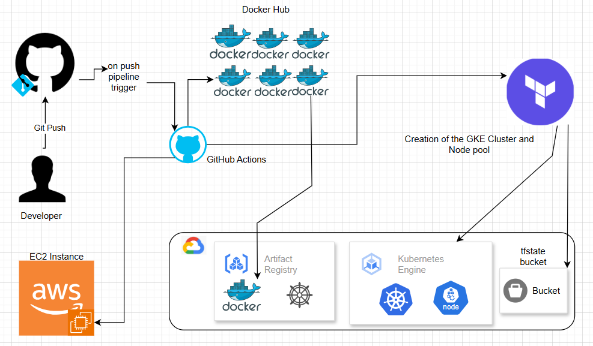

Flask Gif app

# Flask App with Kubernetes, Docker, Terraform, and CI/CD

## Project Overview
This project is a Flask web application with a MySQL database, containerized with Docker and managed with Kubernetes. It includes a CI/CD pipeline using GitHub Actions and is deployed on a Google Kubernetes Engine (GKE) cluster using Terraform.

## Architecture Diagram


The diagram illustrates the workflow of the project, including GitHub Actions, Docker Hub, Terraform, GKE, and AWS EC2.


## Features
- Flask web application
- MySQL database
- Dockerized application with Docker Compose
- Kubernetes deployment on GKE
- Helm for Kubernetes package management
- Terraform for infrastructure as code (IaC)
- GitHub Actions CI/CD pipeline

## Project Structure
FLASKAPP/ 
├── .github/workflows/ 
│ ├── ci-cd-pipeline.yml 
│ ├── cleanup.yml 
│ ├── terraform-deployment.yml 
│ 
├── env/ 
│ 
├── flaskapp-chart/ 
│ ├── charts/ 
│ ├── templates/ 
│ │ ├── _helpers.tpl 
│ │ ├── flask-app-deployment.yml 
│ │ ├── mysql-configmap.yml 
│ │ ├── mysql-deployment.yml 
│ │ ├── NOTES.txt 
│ │ ├── secrets.yml 
│ ├── .helmignore 
│ ├── Chart.yaml 
│ ├── values.yaml 
│ ├── templates/ 
│ ├── index.html 
│ ├── terraform-deployment/ 
│ ├── .terraform/ 
│ ├── .terraform.lock.hcl 
│ ├── main.tf 
│ ├── provider.tf 
│ ├── terraform.tfstate 
│ ├── terraform.tfstate.backup 
│ ├── variables.tf 
│ ├── .gitignore 
├── app.py 
├── docker-compose.yml
├── Dockerfile
├── flaskapp-chart-0.1.0.tgz
├── gifdb.sql
├── Jenkinsfile
├── README.md
├── requirements.txt


## Prerequisites
Ensure you have the following installed:
- [Docker](https://www.docker.com/get-started)
- [Kubernetes (kubectl)](https://kubernetes.io/docs/tasks/tools/install-kubectl/)
- [Helm](https://helm.sh/docs/intro/install/)
- [Terraform](https://developer.hashicorp.com/terraform/downloads)
- [Google Cloud SDK](https://cloud.google.com/sdk/docs/install)

## Setup and Deployment
### 1. Clone the Repository
```bash
git clone https://github.com/your-repo/flaskapp.git
cd flaskapp
```

### 2. Build and Run Locally with Docker Compose
```bash
docker-compose up --build
```

### 3. Deploy Infrastructure with Terraform
```bash
cd terraform
terraform init
terraform apply
```
This will provision the GKE cluster.

### 4. Deploy Application to Kubernetes
#### a) Apply Kubernetes Manifests
```bash
kubectl apply -f k8s/
```
#### b) Deploy Using Helm
```bash
helm install flaskapp ./k8s/helm/
```

### 5. Set Up CI/CD
Ensure GitHub Actions workflows (`.github/workflows/`) are correctly configured to trigger deployments automatically.

## Monitoring and Logging
- Check pod status:
  ```bash
  kubectl get pods
  ```
- View application logs:
  ```bash
  kubectl logs -f <pod-name>
  ```
- View Terraform outputs:
  ```bash
  terraform output
  ```

## Contributing
1. Fork the repository
2. Create a feature branch
3. Submit a pull request

## License
This project is licensed under the MIT License. See `LICENSE` for details.


